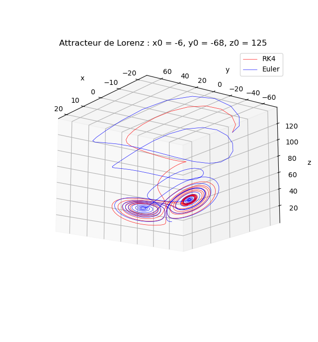
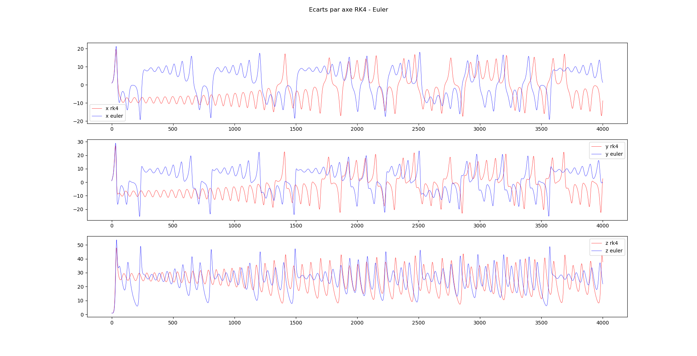

# Attracteur de Lorenz

Un visualisateur d'attracteur de Lorenz en python

## Quickstart

1. Utiliser les constantes souhaitées

```py
SIGMA       = 10
BETA        = 8/3
RHO         = 28
ITERATION   = 40
PAS         = 0.01
INIT_X      = 1.0
INIT_Y      = 1.0
INIT_Z      = 1.0
```

2. Lancer le script

3. Visualiser l'attracteur avec les méthodes RK4 et Euler



4. Visualiser la différence par axe entre RK4 et Euler


