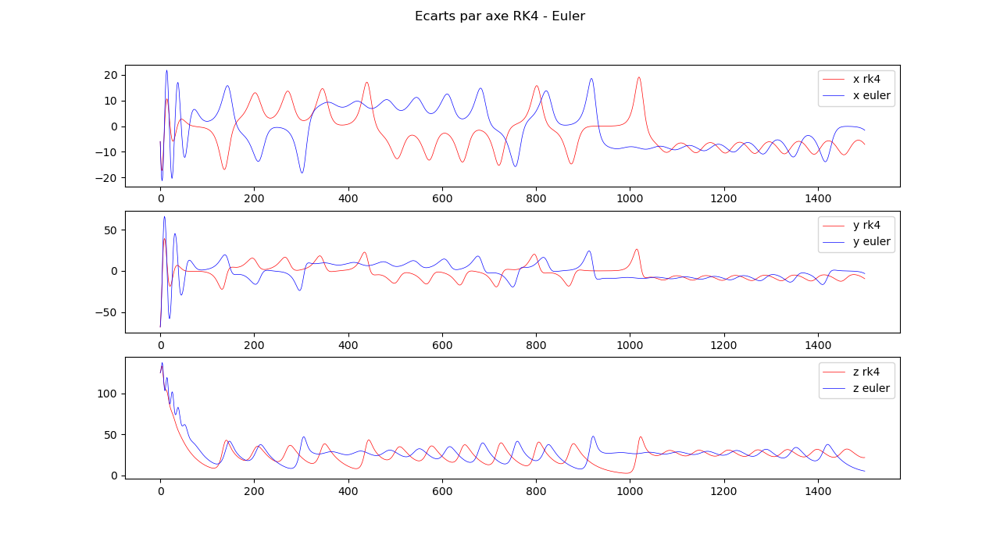

# Attracteur de Lorenz

Un visualisateur d'attracteur de Lorenz en python

## Quickstart

1. Utiliser les constantes souhaitées

```py
SIGMA       = 10
BETA        = 8/3
RHO         = 28
ITERATION   = 40
PAS         = 0.01
INIT_X      = 1.0
INIT_Y      = 1.0
INIT_Z      = 1.0
```

2. Lancer le script

3. Utiliser le gui


a. Modifier la position initiale

b. Rafraichir la vue avec le bouton raifraichir

c. Sauvegarder les graphes avec le bouton sauvegarder

4. Visualiser l'attracteur avec les méthodes RK4 et Euler


5. Visualiser la différence par axe entre RK4 et Euler


